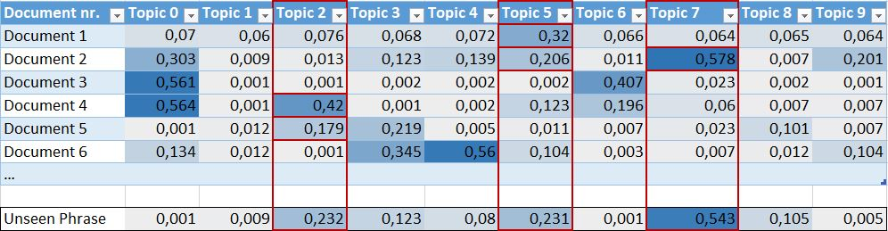

# Machine Learning - Topic extraction for European Commission Legislations

Building a `machine learning` model in `python` for topics extraction and relate all legislations by their similarity.<br/><br/>
Given a new phrase, the model with predict the topic is about and will list all related legislations.
`LDA (Latent Dirichlet Allocation)` unsupervised machine-learning model will be used for classifying documents into topics and prediction. <br/>

Dataset of legislations are downloaded from the Official Journal of the European Commission using this [project](https://github.com/ermalaliraj/eur-lex-official-journal-sparql).<br/><br/>
This project has been built as part of the [dissertation](./PG_Dissertation_Ermal_ALIRAJ_public.pdf) for the Postgraduate Studies in Big Data & Analytics at University of Leuven. 

# Algorithm Steps

1. Load all `documents` from the filesystem, clean and pre-process the content, and build a list with tuples _<FileName, FileContent>_
    ```
        [
            [fileName1, fileContent1],
            [fileName1, fileContent2],
            ...
        ]
    ```
2. Build the `LDA model`:
    ```
    documents_words = documents[:, 1]
    id2word = corpora.Dictionary(documents_words)
    bow_corpus = [id2word.doc2bow(document) for document in documents_words]
    lda_model = LdaModel(corpus=bow_corpus, id2word=id2word)
    ```
    - `Dictionary` with all the words present in all files is created.
    - `Bag of Words` is created for each file using the dictionary. A BoW is a list of tuples <tokenId, tokenCount>, expressing 
    how many times a word is present in other documents. `Corpus Bag of Words` is built putting all BoWs together.
    - `LDA model` with the Dictionary and Corpus BoW is built.

    `Topics` calculated by the LDA model are a set of words followed by a probability. 
    See the chart below for distribution of topics and their words.
3. `Prediction function`:
   - Using the LDA model’s Dictionary, we calculate the `BoW` for a given `unseen phrase`.
   - The model will calculate the relation the new BoW has with each topic.
   - A list of tuples `<topicId, probability>` will be returned, and after ordering we take the highest probability, 
   which is the **predicted topic**. 
    ```
    def predictTopic(lda_model, unseen_phrase): 
        id2word = lda_model.id2word 
        unseen_bow = id2word.doc2bow(unseen_phrase) 
        predicted_topics = sorted(lda_model[unseen_bow]) 
        return predicted_topics[0][0]
    ```
   
4. MAPPER `topic_to_documents`    
    - Treat the full file as an unseen phrase, and predict the topic using the prediction function of step 3. 
    - Repeat the process for each file adding its filename to the predicted topic's list, building a `topic_to_document` mapper as follows.
      ```
      [
          [topic0, [docName1, docName2, docName3]]
          [topic1, [docName4]]
          ...
      ]
      ```
      Code:
      ```
      topic_to_documents = defaultdict(list) 
      for doc in documents: 
        prediction = predictTopic(lda_model, doc[1]) 
        topic_to_documents[prediction].append(doc[0])
      ```
5. `Test the model`
    - An unseen phrase is given for prediction.
    - Call the `prediction function` which gives us the predicted topic.
    - Using the MAPPER, we extract the list of files associated with that topic.
    ```
    unseen_phrase = 'In order to ensure a consistent level of protection for natural persons ....' # phrase taken from GDPR reg
    predictedTopic = predictTopic(lda_model, unseen_phrase.split()) 
    print("unseen phrase: ", unseen_phrase) 
    print("Predicted Topic", predictedTopic, "-", lda_model.print_topic(predictedTopic)) 
    print("Documents containing Topic", predictedTopic,
    ```

    Output:
    ```
    Predicted Topic 4 - 0.072*"datum" + 0.034*"personal" + 0.028*"processing" + 0.026*"subject" + 0.024*"authority" + 0.021*"supervisory" + 0.020*"controller" + 0.014*"protection" + 0.013*"right" + 0.013*"purpose"
    Documents containing Topic 4 - ['reg_2016_679_akn_nr119seq0001.xml']
    ```

The file containing all the described steps in sequence is [`ALL.lda-topic-modeling-ec-laws.py`](./ALL.lda-topic-modeling-ec-laws.py). 

### Topics distribution 


### Limitations and improvements
The actual implementation is not the most accurate approach because we are associating only one topic to a regulation, 
but often regulations talk about different topics. 
Rather than choosing the most ranked topic for a document, and for the unseen phrase too, would be better if we build a matrix with the probabilities as follow:



This way we know that our unseen phrase is talking about 3 different topics: `Topic2, Topic5 and Topic7` and when it’s time for document extraction, we extract:
- `Document 4 and 5` for Topic2; 
- `Document 1 and 2` for Topic5; 
- `Document 2` for Topic7. 

To achieve this solution the algorithm should consider `Euclidean distances` between the topic and documents. To be implemented!

# Project Structure files
Running the single `python` file will penalise the execution time. 
The model requires around 20 minutes to be built for the range of 1500 legislations. 
There is no need to create and train the model each time we want to do a prediction.
Typically the model will be created only once and used many times for prediction.
Only when the data set, or the pre-processing strategy changes, we need to recreate the model. 

For this reason the project has been split in the following files:

- `1.create_documents_array.py`
    - Loads all documents, reads fileContent, cleans xml, lemmatize, and creates the array `documents` 
     with tuples _<FileName, FileContent>_.
    - OUTPUT: save the array `documents` in the filesystem. 
    - EXAMPLES: different .pkl files are created for regulations of 2016, 2017, 2018, 2019 2020 and ALL. <br/>
    For regulations of the year 2016 use the file [./model/EU_REG_year-2016_documentsArr.pkl](./model/EU_REG_year-2016_documentsArr.pkl). 

- `2.create_lda_model.py`
    - Loads from the filesystem the array documents created in previews .py file and creates the `LDA model`.
    - OUTPUT: creates .pkl files in filesystem:
        - `bow_corpus`, Bag of Words for all documents.
        - `lda_model`, the model.
    - EXAMPLES: different models, and the related bow_corpus, for regulations of 2016, 2017, 2018, 2019 2020 are created
     in the folder [./model](./model). 

- `3.visualize.py`
    - Visualises topics distribution of the model.
    - Uses file `2.create_lda_model.py`.
    - OUTPUT: Html file with interactive visualisation. Ex [`./model/EU_REG_year-2016_nrtopics20_visualize.html`](./model/EU_REG_year-2016_nrtopics20_visualize.html)
    
- `4.predict_topic.py`
    - Tests the model using an unseen phrase and print the predicted Topic closer to the phrase. <br/>
    - Uses file `2.create_lda_model.py` 
    - OUTPUT: Print in the console the result of 4 predictions. 
     See [`predict.out`](./out/predict.out) with all predictions. Or full [`logs`](./out/console.out)

- `5.create_mapper_topic_to_docs.py`
    - Builds a mapper Topic-Documents.
    - Uses files `2.create_lda_model.py` and `4.predict_topic.py`.
    - OUTPUT: Ex, mapper [`./model/EU_REG_year-2016_nrtopics20_topic_to_docs.pkl`](./model/EU_REG_year-2016_nrtopics20_topic_to_docs.pkl)

- `6.predict_documents.py`
    - Tests the model using an unseen phrase and print the topic closer to the phrase, together with the list of documents containing that topic. 
    - Uses files `2.create_lda_model.py` and `4.predict_topic.py` and `5.create_mapper_topic_to_docs.py`
    - OUTPUT: Print in the console the result of 4 predictions. See [`logs`](./out/console.out)
    

# Part-of-speech (POS) tagging for GDPR regulation 
The following info is used during the Lemmatization of the document content to reduce dimensionality of the dictionary for topic modelling.
Less frequent lemmas are removed in the pre-processing phase. 


### Links
- [Get regulations from EUR-lex - Dataset](https://github.com/ermalaliraj/eur-lex-official-journal-sparql)
- [Topic Modelling by Félix Revert](https://towardsdatascience.com/the-complete-guide-for-topics-extraction-in-python-a6aaa6cedbbc)
- [Topic Modelling by Susan Li](https://towardsdatascience.com/topic-modeling-and-latent-dirichlet-allocation-in-python-9bf156893c24)
- [LDAModel](https://radimrehurek.com/gensim/models/ldamodel.html)
- [Dictionary and BoW](https://radimrehurek.com/gensim/corpora/dictionary.html)
- [Topic model using ktrain library](https://towardsdatascience.com/topic-modeling-and-latent-dirichlet-allocation-in-python-9bf156893c24)
- [My Topic modelling using ktrain](./ktrain_model)
- [My BigData And AI Portfolio](https://github.com/ermalaliraj/bigdata_and_ai)
