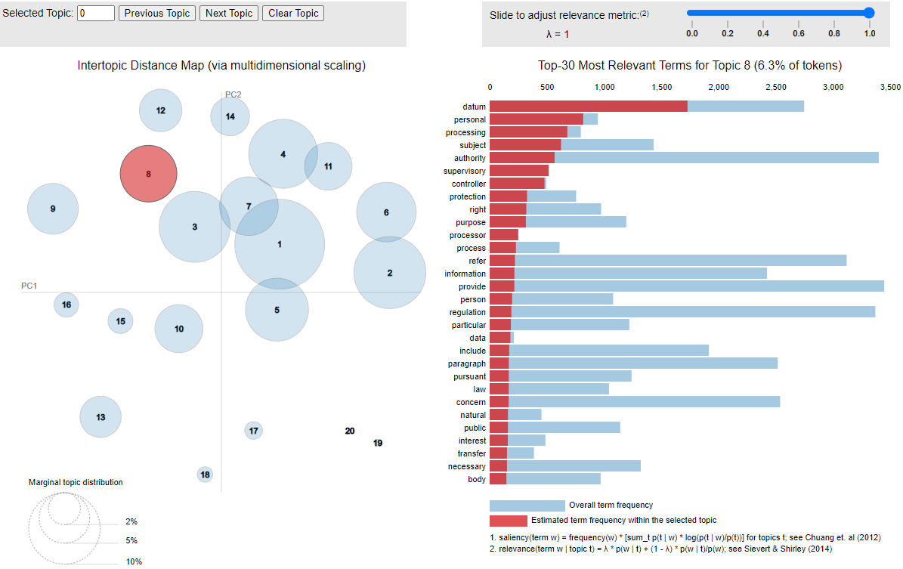
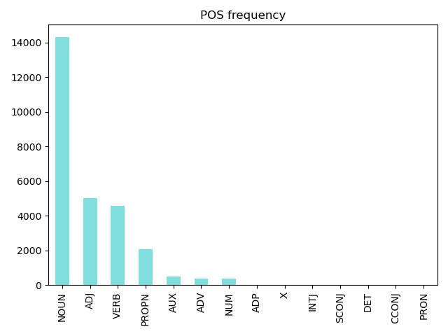

# Machine Learning - LDA Topic Modelling for EC Regulations/Laws

Building a `machine learning` algorithm for predicting to which Topic a Document belongs to.
`Linear Discriminant Analysis (LDA)` technique will be used for classifying documents into topics and than predicting.  
Documents are download from Official Journal of European Commission using this [project](https://github.com/ermalaliraj/eur-lex-official-journal-sparql).

### Project Structure
The project is split in 3 files. 
1. `serialize_documents_array.py`
    - WHAT: load all documents, read fileContent, clean xml, leammatize, and create the array `documents` with rows [fileName, fileContent] for each document.
    - OUTPUT: serialize the array `documents` in filesystem 
    - EXAMPLES: already serialized in different files regulations of years 2016, 2017, 2018, 2019 2020 and ALL.  
    Ex: for regulations of 2016 use the file `./model/EU_REG_year-2016_documentsArr.pkl` in point 2. 
2. `serialize_model.py`
    - WHAT: load the array `documents` from the filesystem and calculate the followings:
        - `corpus_words = documents[:, 1]`
        - `id2word = corpora.Dictionary(corpus_words)`
        - `bow_corpus = [id2word.doc2bow(document) for document in corpus_words]`
        - `lda_model = LdaModel(corpus=bow_corpus, id2word=id2word)`
    - OUTPUT: serialize in filesystem:
        - `bow_corpus`
        - `lda_model`
    - EXAMPLES: already serialized in different files the model and the related bow_corpus for regulations 2016, 2017, 2018, 2019 2020 and ALL. 
3. `visualize.py`
    - WHAT: Visualise topics distribution of the model. 
    - OUTPUT: Html file Ex `./model/EU_REG_year-2016_nrtopics20_visualize.html`
4. `predict.py`
    - WHAT: Test the model. Call the model using an unseen phrases and print the prediction made by it about which topic the phrase is closer too. 
    In prediction 1 the phrase is taken from GDPR regulation. See [`predict.out`](predict.out).
    - OUTPUT: Print in the console the result of 4 predictions.
5. `serialize_mapper_topic_to_docs.py`
    - WHAT: Build a map Topic-Documents. 
    1) For each document, use the content to call the model and predict the related Topic.
    2) Append the document filename to the predicted topic element in the list.
    [   
        [topic0, [doc1, doc2, doc3]]
        [topic1, [doc1]]
        ...
    ] 
6. `predict_documents.py`
    - WHAT: Test the model. Call the model using an unseen phrase, predict the closest topic to the phrase, and print the list of documents containing that topic. 

### Topics distribution using gensimvis

### Part-of-speech (POS) tagging ofr GDPR regulation 

### Links
- [Topic model using ktrain library](./ktrain)
 