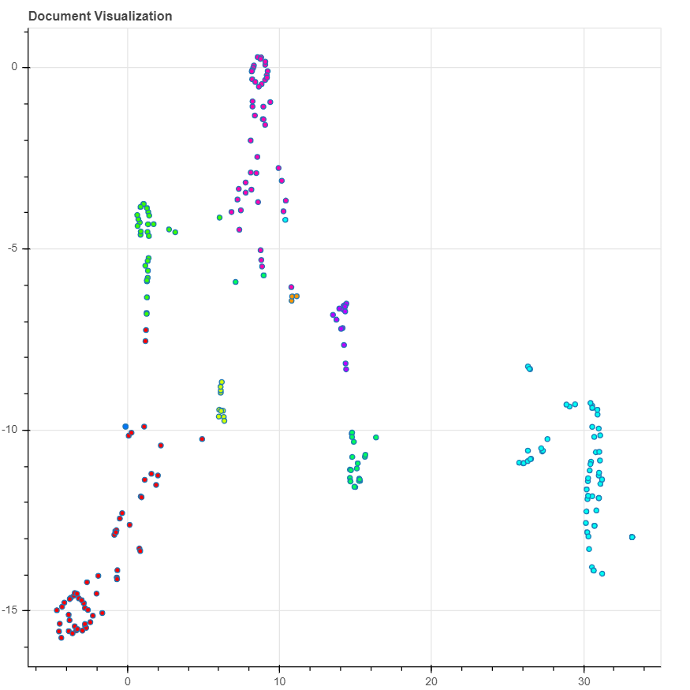

# Topic Modeling using KTrain

Cluster the documents by topics they talk about.

# Run
To run the model follow the steps:

1. Clone the repository:
```
git clone https://github.com/ermalaliraj/python-lda-topic-modeling-ec-laws.git
cd python-lda-topic-modeling-ec-laws/ktrain
```   
2. Install Requirements:
```
pip install -r requirements.txt
```

3. Train The Model:
```
python train_model.py
```
4. Run the model:
```
python predict.py
``` 
5. Enter your text. The model would predict the topic and other documents related to it.


# Visualizations

Running the app `visualize.py` a document distributions will be shown as  follow.


 
 
# Conclusions about Ktrain
    
    - PROS:
        - Easy to implement
    - CONS:
        - A document is not expressed as a distributions of Topics, instead as a single Topic.
    
 
### Links 
- [ktrain](https://pythonrepo.com/repo/amaiya-ktrain-python-deep-learning)